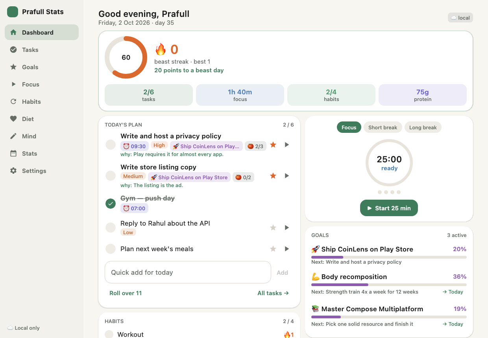
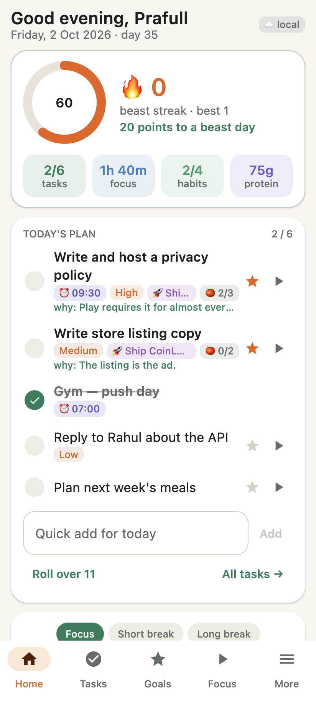
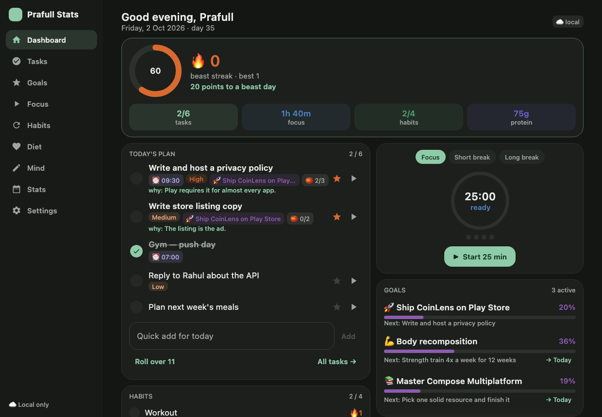

# Prafull Stats

A personal operating system for one person: plan the day, chase goals, focus with a
pomodoro, keep habit streaks, track diet and macros, empty your head, and review it
all. The same Compose code runs on **Android** and as a native **macOS** app that
lives in the menu bar. Data syncs between them through **Firebase**.



| Phone | Mac, dark |
|---|---|
|  |  |

## What's inside

| Screen | What it does |
|---|---|
| **Dashboard** | Day score and beast streak, today's plan, pomodoro, habits, goals, diet and water, brain dump, last 7 days. |
| **Tasks** | Today's plan with Top 3, time blocks, priorities, pomodoro estimates, a *why* per task, a backlog, plan-ahead for the next week, and a one-tap roll-over of unfinished work. |
| **Goals** | Goals with a *why*, area, deadline, an optional number to move (installs, kg, ₹/month), and ordered steps that each carry their own *why*. Any step can be sent to today as a task, and ticking the task ticks the step. Templates include **Publish an Android app on Play Store**, with the real Play Console steps such as the 12-tester / 14-day closed test. |
| **Focus** | Pomodoro with short and long breaks, cycles, auto-start, and links to a task. Each session is logged against that task and its goal. On Android the countdown shows in a notification; on Mac it's in the menu bar and in an always-on-top mini timer. |
| **Habits** | Yes/no or counter habits on chosen weekdays, each with a *why*. Streaks skip days a habit isn't scheduled. |
| **Diet** | Your own daily food plan (tick instead of re-entering), core foods, an off-plan food library stored per 100 g, protein / carbs / fat / fiber / calorie goals, water and weight. |
| **Mind** | Brain-dump inbox (each item can become a task), mood / energy / sleep check-in, a journal (win, gratitude, lesson, tomorrow's first move) and a weekly review. |
| **Stats** | Streaks, a 16-week day-score heatmap, focus per goal, weekly charts for focus, tasks, protein and calories, weight trend, averages, and habit adherence. |
| **Settings** | Name, light / dark / system theme, daily targets, pomodoro lengths, Firebase sign-in, JSON backup, and open-at-login on Mac. |

The **day score** (0–100) averages everything that applies to that day: protein,
calories, fiber, core foods, habits, tasks, Top 3, water, focus and sleep. A day at or
above your threshold (80 by default) extends the beast streak.

## Project layout

```
shared/        Kotlin Multiplatform (Android + desktop JVM): models, storage, scoring,
               Firebase sync and every Compose screen
androidApp/    Android host: activity, notifications, timer alarm, backup intents
desktopApp/    macOS host: window, menu bar tray, mini timer, launch at login
firebase/      Firestore security rules
```

## Build and run

```bash
./gradlew :androidApp:installDebug         # Android
./gradlew :desktopApp:run                  # Mac, from source
./gradlew :desktopApp:packageDmg           # Mac installer → desktopApp/build/compose/binaries/main/dmg/
./gradlew :shared:desktopTest              # unit tests
./gradlew :desktopApp:snapshots            # renders every screen to desktopApp/build/snapshots
```

On the Mac, closing the window keeps the app in the menu bar. Quit from the menu bar
icon or with ⌘Q.

## Firebase sync (one-time setup)

Sync runs over Firebase's REST APIs, so the same code serves both platforms and no
`google-services.json` is needed.

1. Create a project at [console.firebase.google.com](https://console.firebase.google.com).
2. **Authentication → Sign-in method → Email/Password → Enable.**
3. **Firestore Database → Create database** (production mode, any region).
4. Publish the rules in `firebase/firestore.rules`. Either paste them into
   *Firestore → Rules*, or run:
   ```bash
   cd firebase && firebase login && firebase use --add && firebase deploy --only firestore:rules
   ```
5. **Project settings → General**: copy the **Web API key** and the **Project ID**.
6. In the app, open **Settings → Cloud sync** and paste both. Use **Create account**
   once, then **Sign in** with the same email on the other device.

Data lives under `users/{uid}/days/{date}` and `users/{uid}/sections/{name}`. When the
same document is edited on two devices, the newer edit wins. The app pushes about a
second and a half after each change and pulls every 20 seconds. Without sign-in
everything stays on the device.
